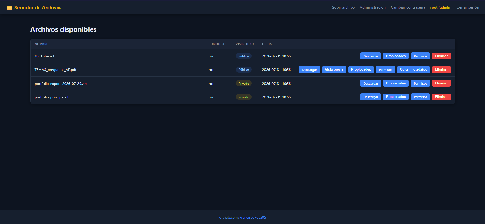

# httpWebServer

---
Servidor web para compartir archivos en tu red local: subes, decides quién puede
ver cada archivo (solo tú, usuarios concretos o cualquiera) y lo levantas entero
con un solo comando gracias a Docker.



## ✨ Características ✨
---

- 🔐 **Usuarios y sesiones**: el primer arranque te lleva a crear la cuenta de
  administrador. Desde `/admin` das de alta más usuarios, reseteas contraseñas o
  eliminas cuentas. Los usuarios nuevos están obligados a cambiar su contraseña
  al entrar por primera vez.
- 👁️ **Permisos por archivo**: público (descargable sin iniciar sesión), privado
  solo para ti, o privado compartido con una lista concreta de usuarios. Se puede
  cambiar en cualquier momento desde la vista de permisos.
- 📤 **Subidas sin límite de tamaño ni de tiempo** por defecto: el tope real lo
  pone tu disco. Se pueden subir varios archivos a la vez. Si lo expones fuera
  de la LAN puedes poner un límite por subida y una cuota por usuario
  (`MAX_UPLOAD_MB`, `USER_QUOTA_MB`) —y ese límite **no se aplica dentro de la
  red local**, que es donde no protege de nada—, y el servidor reserva siempre
  un margen de disco libre para que nadie pueda dejarlo inservible llenándolo.
  Cada archivo se escribe en el disco una sola vez, sin el temporal intermedio
  y la copia que hace por defecto la biblioteca web.
- 🔍 **Vista previa en el navegador** de imágenes, PDF, audio, vídeo y texto,
  sin tener que descargar nada. La lista de tipos permitidos es una allowlist
  explícita, para que no se pueda ejecutar HTML o SVG malicioso.
- 🧹 **Borrado de metadatos** de imágenes y PDFs con un clic, útil antes de
  compartir algo públicamente.
- 🛡️ **Seguridad**: protección CSRF en todos los formularios, contraseñas
  hasheadas con política mínima, bloqueo por intentos fallidos de login,
  cabeceras de seguridad (CSP sin `unsafe-inline`, HSTS con TLS) y nombres de
  archivo saneados en disco.
- 🔒 **HTTPS en la red local con un clic**: desactivado por defecto. Al activarlo
  desde *Administración → HTTPS* se crea una autoridad certificadora propia, se
  firma el certificado del servidor y se te da el certificado para descargar e
  instalar en el PC y en el móvil, con las instrucciones de cada sistema. A
  partir de ahí el candado sale verde de verdad, sin avisos que ignorar.
- 🔄 **Actualización con vuelta atrás**: `./docker-update.sh` actualiza, espera a
  que la versión nueva responda y vuelve sola a la anterior si no arranca.
- 📜 **Logs por consola**: cada petición queda registrada con IP, método, ruta,
  código de respuesta, usuario y tiempo de proceso.

## 🖥️ Requisitos
---

- 🐳 **Docker** y **Docker Compose** (método recomendado). Nada más: los scripts
  resuelven el puerto y la versión con `sed` y `awk`, sin necesitar Python en el
  host.

Si prefieres ejecutarlo sin Docker, necesitas Python 3 y las dependencias de
[`requirements.txt`](requirements.txt) (Flask, Flask-Login, Flask-WTF, Pillow,
pypdf y waitress).

## 📦 Guía de instalación ⚙️
---

### 🚀 Con Docker (recomendado)

```bash
git clone https://github.com/FranciscoFdez05/httpWebServer.git
cd httpWebServer
chmod +x docker-up.sh   # solo la primera vez
./docker-up.sh
```

El script se encarga de todo:

1. 🔑 Crea el `.env` a partir de `.env.example` con una `SECRET_KEY` aleatoria,
   si todavía no existe en esta máquina.
2. 🔌 Lee el puerto de `config.ini` (`[server] port`) y lo exporta como `PORT`,
   para que el mapeo de puertos del contenedor use siempre ese mismo valor.
3. 🏗️ Construye la imagen y levanta el contenedor en segundo plano.

### 🔧 A mano (sin el script)

```bash
cp .env.example .env                                     # 1. secretos
python3 -c "import secrets; print(secrets.token_hex(32))" # pega el valor en SECRET_KEY
export PORT=8000                                          # 2. el puerto de config.ini
docker compose up -d --build                              # 3. arrancar
```

Si te saltas el `export PORT`, el mapeo usa `8000` por defecto, así que solo
falla si tu `config.ini` tiene un puerto distinto.

### 🐍 Sin Docker

```bash
pip install -r requirements.txt
python app.py
```

Arranca con **waitress** (multihilo, para que las subidas grandes por LAN no se
atasquen) y muestra por consola la URL local y la de la red:

```
[INFO] httpWebServer: Servidor escuchando en http://0.0.0.0:8000
[INFO] httpWebServer:   local: http://127.0.0.1:8000
[INFO] httpWebServer:   LAN:   http://192.168.1.152:8000
```

## 📋 Guía de uso 🕹️
---

### 🏁 Primer arranque

Entra a `http://<ip-del-servidor>:<puerto>` (por defecto el puerto `8000`). Como
todavía no hay ningún usuario, la app te redirige a `/setup` para que crees la
cuenta de administrador. A partir de ahí ya puedes iniciar sesión.

### 📂 Día a día

| Quiero... | Dónde |
| --- | --- |
| Ver los archivos a los que tengo acceso | `/` (portada) |
| Subir archivos y elegir su visibilidad | **Subir archivo** |
| Cambiar quién puede ver un archivo ya subido | Botón **Permisos** de su fila |
| Ver un archivo sin descargarlo | Botón **Vista previa** |
| Limpiar los metadatos de una imagen o PDF | Botón **Quitar metadatos** |
| Crear usuarios o resetear contraseñas | **Administración** (solo admin) |
| Cambiar mi propia contraseña | **Cambiar contraseña** |

Quien no ha iniciado sesión solo ve los archivos marcados como públicos.

### ⚙️ Configuración

Lo habitual es no tocar ningún fichero: entra como administrador y ve a
**Ajustes** en la barra superior. Ahí se cambian los límites de subida, la
política de contraseñas y el bloqueo por intentos fallidos, y se activa o
desactiva el **HTTPS**. Los cambios se aplican al momento, sin reiniciar (la
excepción es el HTTPS, que se activa al arrancar).

Lo que guardas ahí vive en el volumen de datos, porque es el único sitio donde
el contenedor puede escribir: `config.ini` se monta en solo lectura y `.env` ni
siquiera está dentro del contenedor.

Para lo que no se puede cambiar en caliente (el puerto, la clave de sesión, si
hay un proxy delante) hay dos ficheros, y la diferencia importa:

- **`config.ini`** son los **valores de fábrica**. Viaja con el código y se
  actualiza con él, así que editarlo en un servidor hace que cada `git pull` dé
  un conflicto. Sirve como documentación: cada ajuste lleva encima el nombre de
  su variable de entorno, en la línea que empieza por `· env`.
- **`.env`** es la configuración de **tu instalación**. No se versiona, así que
  sobrevive a las actualizaciones, y **siempre manda** sobre `config.ini`. Es
  aquí donde se configura un servidor real. Ver [`.env.example`](.env.example).

El orden de precedencia, de más fuerte a más débil, es:

**`.env` → Ajustes de la web → `config.ini`**

`.env` gana a propósito: es la configuración de la máquina, y quien la pone no
quiere que se la cambien desde el navegador. Un ajuste fijado ahí sale
**bloqueado** en la pantalla de Ajustes, diciendo por qué, en vez de dejarte
guardar un valor que luego se ignoraría.

Los ajustes principales:

| Ajuste | Variable | Por defecto | Para qué |
| --- | --- | --- | --- |
| Puerto | `PORT` | `8000` | Puerto publicado y de escucha |
| Clave de sesión | `SECRET_KEY` | (se genera) | Firma cookies y tokens CSRF |
| Proxy con TLS delante | `BEHIND_PROXY` | `false` | Cookies `Secure` + IP real del cliente |
| Límite por subida | `MAX_UPLOAD_MB` | `0` (sin límite) | Frenar subidas enormes |
| Sin límite en la LAN | `LAN_SIN_LIMITE` | `true` | El límite por subida solo se aplica desde fuera |
| Cuota por usuario | `USER_QUOTA_MB` | `0` (sin cuota) | Repartir el disco |
| Reserva de disco | `MIN_FREE_DISK_MB` | `1024` | Que el volumen no se llene del todo |
| Longitud mínima de contraseña | `MIN_PASSWORD_LENGTH` | `12` | Política de contraseñas |
| *(los cinco anteriores se cambian mejor desde **Ajustes**)* | | | |
| Forzar HTTP | `HTTPS_ENABLED` | (sin fijar) | `false` recupera el arranque si un certificado falla |
| Intentos antes de bloquear | `LOGIN_MAX_ATTEMPTS` | `10` | Frenar la fuerza bruta |

**Datos** → volumen Docker `httpWebServer`, montado en `/data` dentro del contenedor
(`/data/uploads` para los archivos, `/data/app.db` para la base de datos y
`/data/backups` para las copias previas a cada actualización). Sobrevive a
`docker compose down` y a reconstruir la imagen.

### 🔄 Actualizar una instalación en marcha

```bash
./docker-update.sh
```

No es `git pull && ./docker-up.sh`. El script, por orden:

1. Se para si has editado `config.ini` en el servidor (el pull chocaría) y te
   explica que eso va en `.env`.
2. Etiqueta la imagen que está corriendo, para tener a dónde volver.
3. Copia la base de datos con la API `backup` de SQLite, antes de tocar nada.
4. Hace el `git pull`, construye la imagen nueva etiquetada con su versión y
   la levanta.
5. **Espera a que `/api/health` responda.** Si no lo hace en 90 s, enseña el log
   y vuelve solo a la imagen anterior.

Lo que el script *no* deshace es una migración del esquema: para eso está la
copia del paso 3, cuya ruta se imprime.

Para reconstruir sin traer cambios: `./docker-update.sh --sin-pull`.

### 🧰 Comandos útiles

```bash
docker compose ps                     # estado del contenedor (y si está healthy)
docker logs -f httpWebServer          # logs en vivo
curl -k https://localhost:8000/api/health  # ¿responde? (-k si el HTTPS es propio)
docker compose down                   # parar (sin borrar datos)
./docker-up.sh                        # instalación nueva: construir y levantar
./docker-update.sh                    # instalación existente: actualizar
docker volume ls | grep httpWebServer # dónde viven los datos
python -m pytest -q                   # tests (pip install -r requirements-dev.txt)
```

### 🔒 Activar HTTPS en la red local

Por defecto va por HTTP sin cifrar. Para cifrarlo **sin salir de la LAN** no
sirve Let's Encrypt: no emite certificados para direcciones como
`192.168.1.50`. La solución es una autoridad certificadora propia, y el
servidor la crea y la reparte por ti.

1. Entra como administrador y pulsa **Ajustes** en la barra superior.
2. Revisa las direcciones que debe cubrir el certificado (viene rellenado con
   la que estás usando y las IPs del servidor) y pulsa **Crear certificado**.
3. **Descarga `ca.crt` e instálalo** en cada PC y móvil. La página trae las
   instrucciones de Windows, Android, iPhone, macOS y Linux. Desde el móvil
   puedes abrir directamente `http://<ip>:<puerto>/ca.crt` — no hace falta
   iniciar sesión.
4. Reinicia el servidor: `docker compose restart`.
5. Entra por `https://<ip>:<puerto>`.

Detalles que evitan los tropiezos habituales:

- **En iPhone hay un segundo paso** que casi todo el mundo se salta: después de
  instalar el perfil, hay que activarlo en *Ajustes → General → Información →
  Ajustes de confianza de certificados*. Sin eso el aviso sigue saliendo.
- **Si cambia la IP del servidor**, usa *Regenerar certificado*: se firma con la
  misma autoridad, así que **no** hay que reinstalar nada en los dispositivos.
- **Desactivar el HTTPS no borra los certificados**, para que reactivarlo no
  obligue a repetir la instalación en todos lados.
- La clave privada de la autoridad (`ca.key`) vive en `/data/tls` con permisos
  `600` y **nunca** se sirve por HTTP. Guárdala como guardarías una contraseña:
  quien la tenga puede suplantar cualquier web ante los dispositivos que hayan
  instalado la CA. `./docker-update.sh` la copia a `backups/tls` al actualizar.
- Si un certificado roto impidiera arrancar, `HTTPS_ENABLED=false` en `.env`
  fuerza el arranque en HTTP.

Esto cifra el tráfico dentro de tu red. Para exponer el servidor a internet
sigue siendo mejor un proxy con un certificado público:

### ⚠️ Exponerlo fuera de la LAN

Por defecto va por **HTTP plano**, que es lo razonable en una red local de
confianza pero no fuera de ella: sin TLS, la contraseña y la cookie de sesión
viajan en claro y cualquiera en el mismo camino las lee.

Para exponerlo a internet hacen falta dos cosas, y las dos:

1. **Un proxy inverso con TLS** delante (Caddy es el de menos trabajo; también
   valen nginx o Traefik).
2. **`BEHIND_PROXY=true` en `.env`.** Marca las cookies como `Secure` y hace que
   el servidor lea la IP real del cliente de las cabeceras `X-Forwarded-*`. Sin
   esto, todas las peticiones parecen venir del proxy y el bloqueo por intentos
   fallidos cuenta a todo el mundo en el mismo cubo, con lo que deja de servir.

   Actívalo **solo cuando el proxy ya esté puesto**: con `Secure` y sin TLS, el
   navegador nunca devuelve la cookie y el login se queda en un bucle sin
   ningún mensaje de error.

Conviene además ponerle un `MAX_UPLOAD_MB` y un `USER_QUOTA_MB`. Ojo con dos
cosas al exponerlo:

- `MAX_UPLOAD_MB` **no se aplica a quien entra desde una IP privada**, porque de
  fábrica `LAN_SIN_LIMITE` está en `true`. Con un proxy inverso delante y sin
  `BEHIND_PROXY=true`, todas las peticiones llegan con la IP del proxy y
  parecerían venir de la LAN: o pones `BEHIND_PROXY=true` (que es lo correcto
  igualmente), o desactivas el ajuste desde **Ajustes**.
- Sigue sin haber 2FA.

## 🤝 Contribuciones 🤝
---

Las contribuciones son bienvenidas. Si encuentras un fallo o se te ocurre una
mejora:

1. 🍴 Haz un fork del repositorio.
2. 🌿 Crea una rama para tu cambio (`git checkout -b mejora/nueva-funcion`).
3. ✅ Pasa los tests (`pip install -r requirements-dev.txt && python -m pytest`).
4. 💾 Haz commit de tus cambios (`git commit -m "Añade nueva función"`).
5. 🚀 Sube la rama (`git push origin mejora/nueva-funcion`).
6. 📬 Abre un Pull Request explicando qué cambia y por qué.

Para errores o ideas sueltas, abrir un *issue* también vale.

## 📜 Licencia
---
📄 Este proyecto está licenciado bajo la Licencia MIT. Consulta el archivo `LICENSE` para más detalles..

---

**Developed with ❤️ by [Francisco](https://github.com/FranciscoFdez05)**
